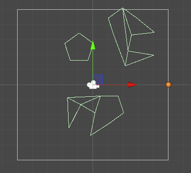
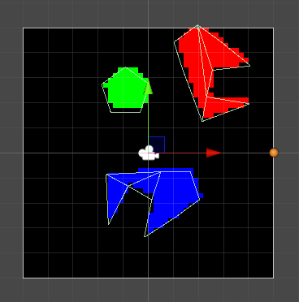

Just some helper classes to store game world data in grid format using int masking to speed up some calculations + a way to visualize it using unity sprites.

World data example (colliders):

Grid data:

