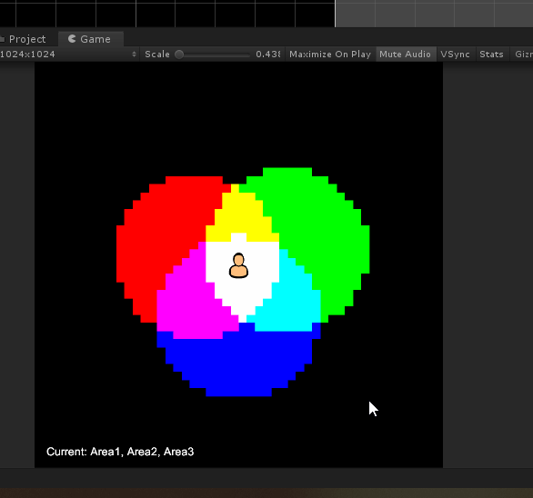

Just some helper classes to store game world data in grid format using int masking to speed up some calculations + a way to visualize it using unity sprites.

Grid being updated in runtime:

Reading data from grid given specific coordinates (example in code):

World data example (colliders):

Grid data:

Grid data with mixed values:

